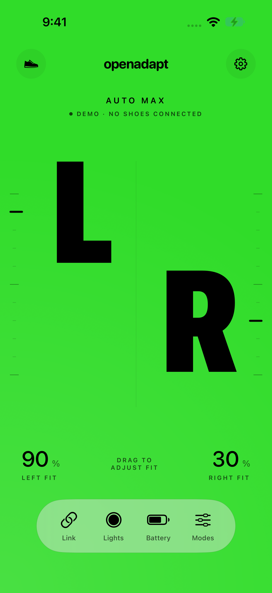
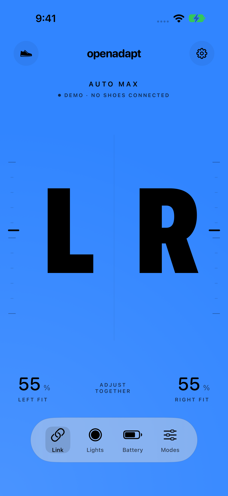
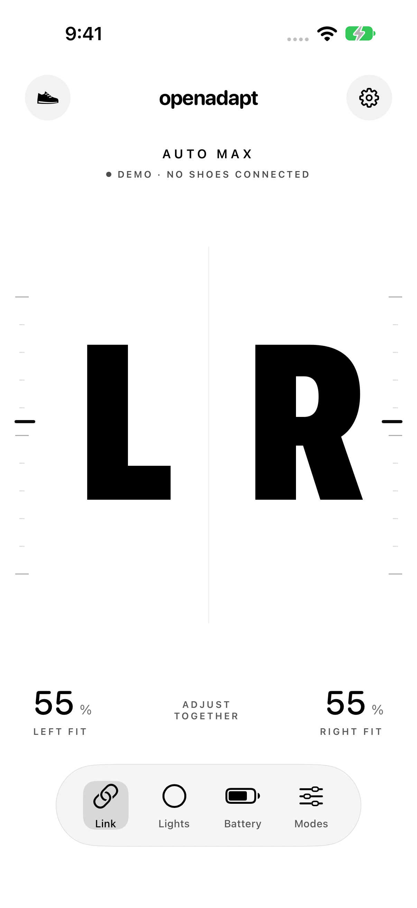

# OpenAdapt for iPhone

Developer mode now includes **Your shoes → Export pairing file** for transferring a completed saved pair to Omarchy. See [pairing transfer](../../docs/ios/PAIRING-TRANSFER.md) for setup, private-key handling, Bluetooth bonding and calibration limits.

An original native SwiftUI/CoreBluetooth client for Nike Adapt Auto Max. iOS 17 or later. MIT licensed under the repository's [license](../../LICENSE). No account, server, analytics, or Nike assets. Enrollment uses the pinned Apple Swift Crypto package (4.5.2).

<p>  </p>

**Development build, not yet a public download.** This iOS port is built and tested offline and in Simulator, and both current Auto Max shoes have authenticated and returned status on the owner’s iPhone. Physical iPhone shoe movement, LED appearance, Siri execution, and haptic feel still require hardware validation. The desktop implementation's successful shoe tests do not verify this new CoreBluetooth implementation.

## Experience

- Oversized L/R controls with independent simultaneous touch tracking, plus a three-button dock for Lights, Battery, and Modes with a sliding Liquid Glass selector on iOS 26+: drag across the options and release to open, or tap directly.
- Direct finger tracking, fit steps of 5%, haptic selection ticks, release feedback, and confirmed-completion feedback.
- During a drag, a target bar follows its L/R control immediately. On release, the letter and a faint target bar hold the selected level while a second, solid bar advances from the last measured position. The estimate takes 2.8 seconds, one second slower than the earlier version; there is no progress caption. Progress during movement is **estimated**, capped short of the destination; only a successful shoe completion event and position readback confirm the final position.
- Native sheets for My shoes, Lights, Battery, Modes, and Settings.
- Nine background [Siri and Shortcuts actions](../../docs/ios/SIRI.md): tie, fit, loosen, saved modes, colors, lights off, battery, connect and disconnect. Tie restores the last successfully applied saved mode without asking for parameters, defaulting to the first saved fit (initially Move at 60% / 60%). Settings offers ready-made “Tie my shoes” and “Untie my shoes” shortcuts when signed resources are present, plus a manual setup guide.
- Twelve base colors applied to both shoes, lights off, battery refresh, and editable local fit presets.
- The main background follows the acknowledged shoe-light color, with black or white controls for contrast. Lights off or unknown color uses white. If the shoes have different colors, the most recently chosen active color sets the background.
- A black sneaker with two blue lights on white is the app icon, using the [shared original vector drawing](../../assets/brand/README.md) that also supplies Omarchy’s theme-aware bar and panel mark.
- VoiceOver adjustable controls, reduced-motion support, system typography, and built-in haptic feedback.
- [My shoes](../../docs/ios/SHOE-LIBRARY.md) cards, connected/disconnected details, nicknames, local shoe appearance, firmware details, and confirmed removal. The retail-name catalog covers five Adapt models; verified control remains Auto Max only.
- Quick Unlace on/off for both shoes through one native switch, confirmed by acknowledgement and matching readback. The off request is derived from the archived GestureOff model; physical validation remains pending. Unfamiliar/multiple mappings are preserved. See [evidence and limits](../../docs/ios/AUTO-LACE-GESTURE-EVIDENCE.md).
- One Auto-Lace switch for both shoes, defaulting to off when no preference is saved. The last preference is saved per pair only after both shoes acknowledge it. Opening the page sends no setting; this is a saved preference, not device state readback.
- Guided Add shoes, wake-up instructions, nearby discovery, and connection/reset help; no JSON-import screen.
- Optional private owner defaults for local Debug builds; credentials persist in the device-only Keychain.
- Quiet disabled L/R state while asleep; Connecting status during an actual reconnect attempt, with cancellation and bounded discovery.

The app supports the explicitly allowlisted **Auto Max 2.4.3M** protocol. First-time enrollment is implemented and tested offline; a reset pair still needs owner-operated hardware validation. Newly paired shoes have battery/light control after authentication, but fit controls require verified calibration, which cannot yet be read for a new pair. The app does not write calibration or the shoe-stored auto-lace fit, customize gesture mappings, upload effects, update firmware, or enable Huarache control.

## Open and build

Use Xcode 26 or newer (this implementation was verified locally with Xcode 27; CI selects Xcode 26.3). The SDK requirement comes from the background App Intents declarations; the app still targets iOS 17 or later. Open `OpenAdapt.xcodeproj`, select the **OpenAdapt** scheme, and run on an iPhone Simulator. The generated project is checked in; XcodeGen is only needed after changing `project.yml` or adding files.

```sh
# From the repository root:
swift test --package-path apps/ios
xcodebuild -project apps/ios/OpenAdapt.xcodeproj -scheme OpenAdapt \
  -configuration Debug -sdk iphonesimulator \
  -destination 'generic/platform=iOS Simulator' CODE_SIGNING_ALLOWED=NO build

# Optional project regeneration:
cd apps/ios
xcodegen generate
```

For a real iPhone, select your own signing team in **Signing & Capabilities**, use a bundle identifier registered to that team, and run on the connected device with Developer Mode enabled. No signing certificate, team ID, profile, or shoe key is checked in.

### Optional ready-made Siri shortcuts

Before building for distribution, generate the two signed shortcut files for your bundle ID and signing team:

```sh
python3 apps/ios/scripts/make-siri-shortcuts.py --bundle-id YOUR_BUNDLE_ID --team-id YOUR_TEAM
```

Apple's signing service validates the credential-free workflows. The generated files are ignored by Git; see [resource setup](Config/SiriShortcuts/README.md). Builds without matching resources keep the manual guide. The optional import UI test skips when these files are absent.

### Simulator interaction demo

A **Debug-only** `--demo` launch argument supplies sample shoes. It never constructs a Bluetooth connection and prominently labels the screen as a demo. Release builds ignore this argument. There is no fake connection fallback in the real-shoe flow.

In Xcode, Edit Scheme → Run → Arguments → add `--demo`. Remove it for real use. Alternatively, after installing a Debug build in a booted simulator:

```sh
xcrun simctl launch booted org.openadapt.ios --demo
```

UI tests bypass owner defaults and exercise independent dragging, modes, lights, battery, guided setup/reset help, connecting/cancel, disabled controls, and the reduced-motion path. Run **Product → Test** or use `xcodebuild test` with an available simulator destination. Protocol tests use entirely synthetic keys and identifiers.

## Guided setup

The public interface starts at **Add shoes**. It keeps a large shoe illustration onscreen, pairs the first nearby shoe, then names the opposite foot for the second button press. Only one shoe enrolls at a time; the complete pair is saved after both credentials verify. Interrupted candidates are retained in Keychain without automatic key-exchange replay. This flow still needs hardware validation; seeing an advertisement does not complete pairing. Newly paired shoes use their physical buttons for fit until calibration can be established. See [first-time pairing](../../docs/ios/FIRST-PAIRING.md). The manual instructions link to [Nike’s official system-reset guide](https://www.nike.com/my/help/a/adapt-troubleshooting); the app never sends a reset command.

For a saved owner pair, Connect shoes searches for the exact left/right names already present in its profile, authenticates the existing keys, and reads status. Only successful authentication saves a CoreBluetooth identifier. Opening the app automatically reconnects the last successfully connected pair. Cached identifiers are tried first; missing or unreachable ones trigger a foreground search. Shoes sharing the same advertised name keep their separate remembered identifiers. The single Connect action starts both saved-shoe connections together, retaining an already connected foot. There is no separate individual-connection action. Unresolved ambiguous identities report a connection failure without changing the saved pair. The complete attempt has a 20-second limit, and Cancel stops it. Bluetooth, firmware, authentication and discovery failures are shown as their actual errors rather than describing every disconnected shoe as asleep. Siri can reconnect those same shoes and complete an action without opening the app. Background actions have a 25-second app deadline and also stop if iOS expires their execution time. Ordinary temporary connections close after a background action; an explicit Connect shortcut retains idle connections. A dropped connection never replays an adjustment. UI-only sessions still disconnect on backgrounding.

### Local owner build (developer setup)

This is a private development convenience, separate from public setup. Copy an existing Omarchy v1/v2 profile to `OpenAdapt/Storage/OwnerPairing.private.json`, then create `Config/Owner.private.xcconfig`:

```xcconfig
OPENADAPT_OWNER_PROFILE_PATH = $(SRCROOT)/OpenAdapt/Storage/OwnerPairing.private.json
OPENADAPT_INCLUDE_OWNER_PAIRING = YES
```

Both files are ignored by Git. The sandboxed build phase reads only its declared input and includes it in **Debug only**. The normal first launch validates and saves it in the device-only Keychain, selecting that pair by default. Existing Keychain pairs are never overwritten, and removing a pair does not trigger automatic reimport. UI tests and demo launches skip both the private seed and Keychain. A clean checkout builds without private files. Release removes the resource even when local owner configuration exists; only Debug binaries built with this option contain the private resource and must stay private.

Linux MAC addresses cannot be passed to CoreBluetooth. CoreBluetooth manages system pairing and may present an iOS dialog. Existing-key authentication and status reads are verified on the owner’s iPhone; preservation and operation of an older phone’s separate Bluetooth bond are not established by those checks.

## Implementation

| Path | Responsibility |
| --- | --- |
| `Sources/OpenAdaptCore/` | Validated profiles, calibrated targets, strict protobuf envelopes, fragmentation, flow control, AES challenge proofs, persistent status/control lifecycle |
| `OpenAdapt/Bluetooth/` | Bounded CoreBluetooth discovery, firmware/characteristic checks, notifications, backpressure, connection cleanup |
| `OpenAdapt/Storage/` | Keychain-only private profile persistence |
| `OpenAdapt/AppStore.swift` | Per-shoe state, explicit commands, cancellation, haptics, modes, estimated progress |
| `OpenAdapt/Views/` | SwiftUI screens plus a UIKit multitouch/VoiceOver control surface |
| `Tests/` | Synthetic Swift protocol/import tests |
| `OpenAdaptUITests/` | Simulator interaction tests |

Wire behavior is ported from this repository's original Python implementation under `spikes/002-local-enrollment`. Normal sessions support existing-key authentication, status, Stop/position, base lights, and the captured feature operations. Enrollment uses a separate explicit 110/111 exchange and setup proof; normal authentication failure cannot trigger it. Firmware must match exactly the observed unpadded revision or 20-byte zero-padded revision before notifications or Nike writes begin.

Fit requests read battery and position, require the shoe off its charger with at least 20% battery, and bound targets by imported calibration. An acknowledged Stop precedes each target. Success requires opcode-3 acknowledgement, opcode-5 completion, and corroborating opcode-4 readback with the observed one-raw-unit tolerance. An in-flight command is never replaced or queued. During protocol failure, the channel may attempt one best-effort Stop on the existing link; delivery is not guaranteed. A radio loss or background disconnect cannot establish physical stopping.

No physical shoe commands were used to develop or verify this port. See [verification and release status](../../docs/ios/VERIFICATION.md).

## Distribution

The source and local build instructions allow owners to build the app. A broadly downloadable iPhone release still needs signing, physical-device validation, and a distribution channel. Apple's [TestFlight](https://developer.apple.com/testflight/) supports public beta invitations after external beta review; a durable App Store release requires its own submission and approval. Open source alone does not make an unsigned `.ipa` installable on arbitrary iPhones.

Fresh-enrollment hardware validation, interrupted-key recovery checks, and fit-calibration discovery remain requirements before recommending the app to owners without saved profiles. The existing owner build retains its calibrated controls.

### Multiple saved pairs

Opening OpenAdapt reconnects the last pair whose two shoes successfully authenticated and returned status. Viewing another pair or a failed/partial attempt does not change that default. To use another pair, open **My shoes** at the top left, choose it, and tap **Connect**. Automatic reconnect tries only the default pair; it never cycles through other saved shoes. Removing the default falls back to the most recently connected remaining pair, then an available saved pair.
