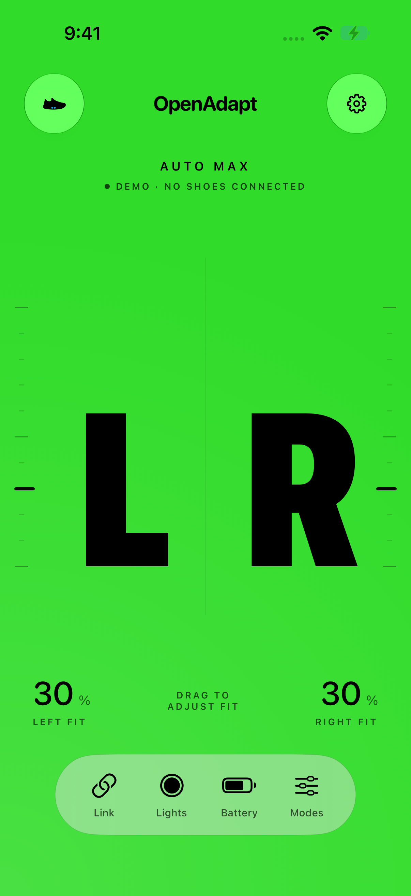
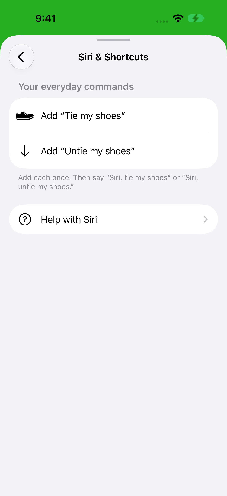

# Settings and top-control motion review

September 21, 2026. Reviewed the changed SwiftUI surfaces with the Apple design and `review-animations` skills. Native system components retain system timing and accessibility behavior; web-specific animation rules are not applied as substitutes for Apple's controls. Screenshots use the labeled Simulator demo.

## Findings

| Before | After | Why |
| --- | --- | --- |
| Top controls used a flat translucent fill and the shared custom press style. | On iOS 26+, use native `.glass` with a circular border shape; keep the custom style only in the fallback. `apps/ios/OpenAdapt/Views/RootView.swift:147` | System press response should not be combined with a second scale animation. Glass supplies the requested native surface and interaction. |
| A translucent top-control background was unconditional. | Reduce Transparency selects an opaque system background, while the fallback's existing press style respects Reduce Motion. `apps/ios/OpenAdapt/Views/RootView.swift:140`, `apps/ios/OpenAdapt/Views/Motion.swift:21` | Preserve readable controls and feedback when transparency or movement is reduced. The root's light/dark appearance follows the control foreground. |
| Setup placed competing instructions and voice phrases together. | Two shortcut actions and one Help navigation link, using native Form/NavigationStack transitions without added entrance or row animations. `apps/ios/OpenAdapt/Views/Sheets.swift:257` | This frequent setup/help navigation needs immediate availability and predictable back navigation, not extra motion. |

## Verdict

### Performance

No new animation timer, layout interpolation, shader, or whole-screen animation was added. The fit timeline is unchanged. Glass rendering belongs to the native button style; no device frame-rate claim is made from screenshots.

### Interruptibility and timing

Native buttons and navigation own their press and transition behavior. The fallback retains the existing interruptible, asymmetric transform/opacity response. There is no additional easing layer or delayed action.

### Accessibility

The top buttons retain a 44-point label frame and explicit accessibility labels. Forms scroll and use native text styles. Reduce Transparency has an opaque fallback; Reduce Motion remains handled by the system style and existing fallback. The current UI tests exercise both top-button navigation and the shortcut/import flow. They do not establish physical haptic feel or prove all system accessibility configurations.

**Approve — the changed native UI motion.** No remaining feel-breaking code finding. Visually reviewed the main Glass controls, Settings, developer details, and Siri setup/help. Hands-on device feel and radio behavior remain separate validation.

