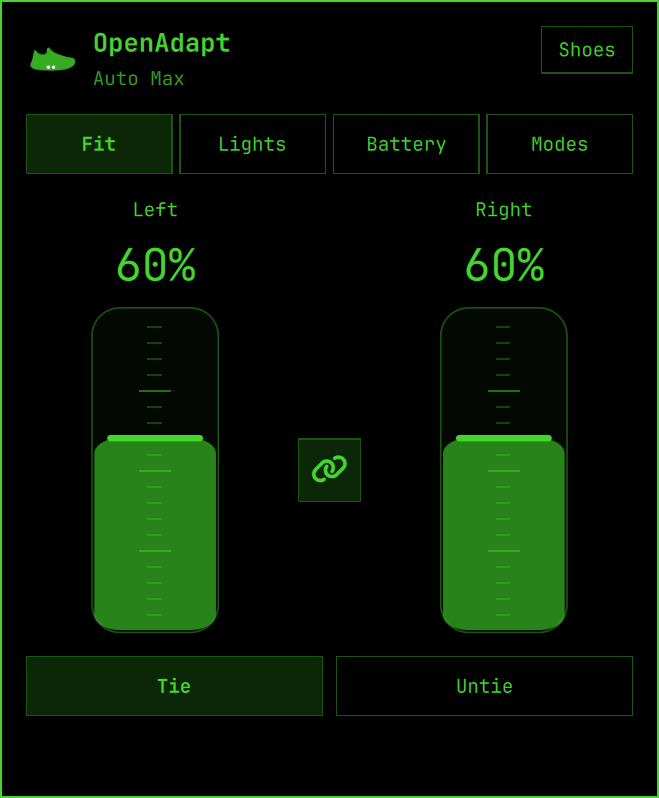
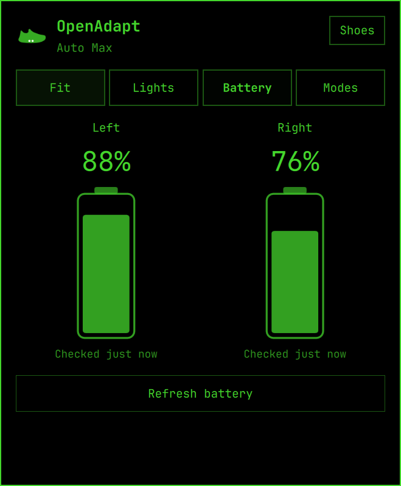

# Omarchy panel polish

September 22, 2026. Implemented and installed on the owner's Omarchy 4.0.4 desktop. Existing plugin identity, bar placement, pairing credentials and calibration are preserved. The installer retained private backups. Installation waited until the shoes were disconnected and the backend was idle; no shoe command was sent by verification.

## Everyday controls

- Fit / Lights / Battery / Modes, opening on Fit. **Shoes** goes directly to Your shoes, which contains Disconnect.
- Fit restores the rounded vertical bars and visible 5% ticks. A chain-link icon is centered horizontally between the bars and vertically against their tracks. It starts highlighted; either bar previews both targets and release sends one paired request. Turning it off enables independent adjustments.
- Battery information appears only in the Battery tab. Read-only battery silhouettes have terminal caps and no slider handle or fit ticks.
- Tie restores the last fit successfully applied to both shoes, falling back to the first saved mode. Defaults are Move 60/60 and Chill 30/30. Untie and manual adjustments preserve that choice.
- Saved modes and preferred-pair history live separately from credentials. Only a complete two-shoe connection changes the default pair. Opening the panel never connects automatically; Connect retries a missing partner.
- Both shoes must be ready for paired controls. Unknown calibration blocks fit; existing charging, battery and fit limits remain enforced. Partial completion is explicit and is never automatically replayed.

## Verification

**410 Python tests and 33 Qt test results pass.** Coverage includes mode persistence, failed and partial connections, pair switching, missing calibration, stale callbacks, per-shoe movement start, single release commits, linked dragging, five-percent keyboard input, Escape cancellation and reduced motion. Light/dark and 1×/1.5× text renders were inspected.

The subsequent concurrent-pair update uses one fresh scan for both saved shoes, then independent connection/authentication tasks. All pair controls run on both channels concurrently, while each shoe's messages remain ordered. Tests require both attempts to begin before either completes, cover either side failing first, and verify that cancellation leaves no pending work. Scanner cleanup must finish before either connection opens; bond, identity and ambiguity checks remain unchanged. This is concurrent communication, not a guarantee of millisecond-synchronized physical motors. First-time enrollment remains the iPhone flow; importing its completed pair does not create a Linux system Bluetooth bond.

The concurrent-pair follow-up is installed; its source corresponds to rewritten revision `9b6bde0`. All 410 protocol/backend tests also passed on Omarchy before deployment. Installation preserved a private rollback backup and left credentials unchanged. Native plugin rescan replaced the old controller with exactly one new process; the production panel loaded and opened Fit without connecting. Installed runtime files match the tested source. No hardware command was sent, so physical concurrent timing remains owner-operated verification.

Standalone QtTest uses explicitly test-only shell adapters because Quickshell's native plugin is statically linked. The real installed Omarchy controls were also loaded in the existing shell with a temporary synthetic fixture, without a Bluetooth backend. Native Fit and Battery screenshots are below. The fixture was removed afterward.

The production panel loaded without OpenAdapt runtime warnings, selected its saved pair, opened Fit without connecting, and navigated directly to Your shoes. This Omarchy version retained old QML after rescan, so the existing shell was restarted while disconnected. Physical motor timing and owner-operated paired controls remain a separate check; synthetic tests do not establish hardware success for this revision. The previously installed V0's hardware results remain historical evidence.

## Motion review

| Before | After | Why |
| --- | --- | --- |
| Target and current position were visually combined | Target follows input directly; stronger fill represents progress | Dragging stays immediate while shoe movement remains distinguishable |
| One animation could imply both shoes had begun | Each shoe's 2.8-second estimate starts at its own motor-command boundary | A shoe still completing preflight must not appear to move early |
| An elapsed estimate could suggest completion | Estimate stops at 90% of the distance until confirmed readback | Duration alone is not evidence of completion |
| Potential motion without a shell preference | Plugin `reduceMotion` disables estimate/settling; measured fill remains | Installed shell has no shared reduced-motion setting |
| Battery fill originally scaled around the wrong origin | Scale anchors at the fill's own bottom | Keeps every charge level within the battery silhouette |

**Interruptibility and timing:** `FootSlider.qml` tracks input directly and uses a retargetable 200 ms settling animation with the reviewed `(0.23, 1, 0.32, 1)` curve. The longer 2.8-second linear movement is operational feedback, not a delayed UI transition. `Model.js` prevents queued or stale estimates from claiming completion. Section selection stays immediate, including keyboard navigation; native shell focus and button feedback remain shell-owned.

**Accessibility:** named native controls, visible native focus, keyboard adjustment/cancellation, text scaling and read-only battery labels are retained. The optional plugin motion setting removes movement estimation and settling.

**Decision: Approve** for this source and synthetic/native UI checkpoint. Physical synchronization still needs owner feedback.

## References

Native structure follows the [official Omarchy skill](https://omarchy.org/manual/ai/#the-omarchy-skill), [plugin guide](https://plugins.omarchy.org/develop.html), and installed Bluetooth/audio panel components. Styling comes from installed `qs.Commons` theme values and `qs.Ui` controls.
